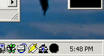

## Animated Tasktray Icon

### Description

What this does is places an icon in the task tray and shows how to animate the icon.
 
### More Info
 

             |
---                |---
**Submitted On**   |2001-02-02 17:35:48
**By**             |[Jim Wilson](https://github.com/Planet-Source-Code/PSCIndex/blob/master/ByAuthor/jim-wilson.md)
**Level**          |Beginner
**User Rating**    |4.5 (36 globes from 8 users)
**Compatibility**  |VB 4\.0 \(32\-bit\), VB 5\.0, VB 6\.0
**Category**       |[Windows API Call/ Explanation](https://github.com/Planet-Source-Code/PSCIndex/blob/master/ByCategory/windows-api-call-explanation__1-39.md)
**World**          |[Visual Basic](https://github.com/Planet-Source-Code/PSCIndex/blob/master/ByWorld/visual-basic.md)
**Archive File**   |[CODE\_UPLOAD14444222001\.zip](https://github.com/Planet-Source-Code/jim-wilson-animated-tasktray-icon__1-14946/archive/master.zip)

